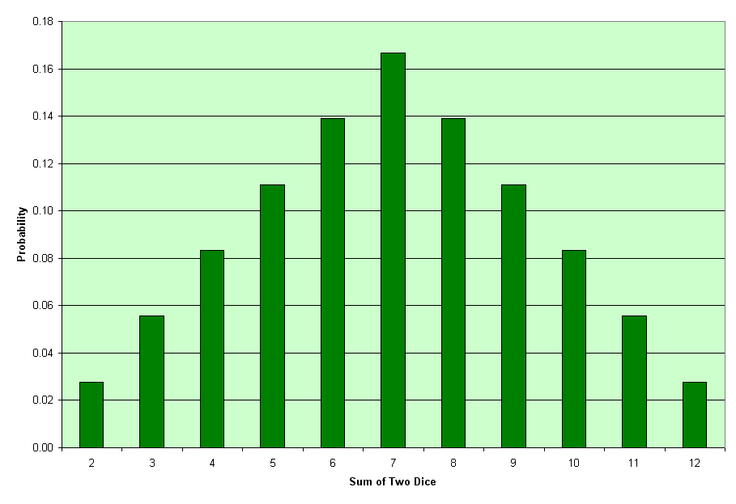
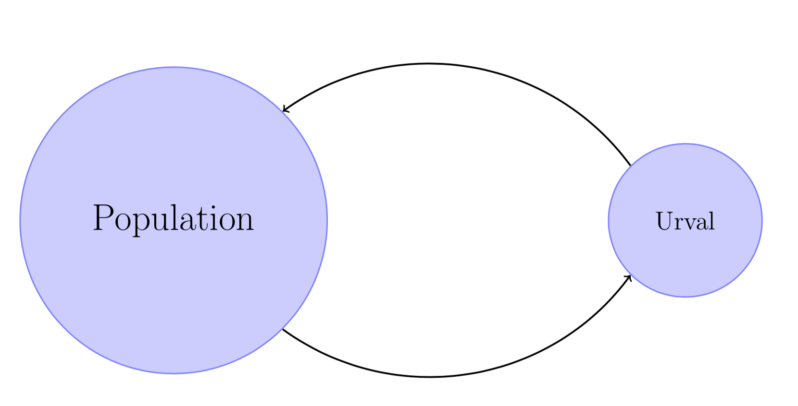

# Föreläsning 3

## Diskret slumpvariabel

* Hur många personer är vänsterhänta i en slumpvis vald stad med invånare?
* Hur många högskolepoäng har en slumpmässigt vald student på webbprogrammeringsprogammet tagit?

Svaren till dessa frågor beror på vilken stad vi valt och vilken student som tillfrågas.

Man säger att "antalet vänsterhänta" och "antal tagna högskolepoäng" är _slumpvariabler_ eller _stokastiska variabler_.


## Sannolikhetsfördelning

Låt \(stora\) $$X$$ vara beteckna en slumpvariabel och \(lilla\) $$x$$ värden som $$X$$ kan anta. Låt $$p(x)$$ vara sannolikheten att variabeln $$X$$ antar värdet $$x$$ , dvs 

$$ \Pr(X=x) = p(x)$$.

Talen $$p(x)$$ kallas slumpvariablens sannolikhetsfördelning. 


### Exempel

Vid kast med en tärning så har vi följande sannolikhetsfördelningarna

$$
\Pr(X=1) = \frac{1}{6}, \quad \Pr(X=2) = \frac{1}{6},  \qquad\ldots \quad ,\Pr(X=6)
= \frac{1}{6}
$$

Vi kan beskriva sannolikhetsfördelningen med stolpdiagram.

## Statistiska mått


## Notation

$$\displaystyle\sum x = x_1 + x_2 + x_3 +\ldots + x_n$$ 



## Aritmetisk medelvärde

Medelvärdet $$\overline {x}$$ för $$n$$ observationer $$ x _{1} , x_{2} , \ldots , x _ {n}$$ 

$$\overline{x} = \cfrac {x_{1} + x_{2} + \ldots + x_{n}}{n} = \cfrac{\displaystyle\sum x}{n}$$ .



## Väntevärde

Väntevärdet för variabeln $$X$$ är

$$E ( X ) = \mu = \displaystyle\sum x \cdot p ( x ) = x_1 \cdot p(x_1) + x_2 \cdot p(x_2) + \ldots + x_n \cdot p(x_n)$$.


Med notationen$$E$$ menas **expected value** 

### Exempel

Vad är väntevärdet för ett tärningskast?

$$
\mathrm { E } (X) = 1 \cdot \frac { 1 } { 6 } + 2 \cdot \frac { 1 } { 6 } + 3 \cdot \frac { 1 } { 6 } + 4 \cdot \frac { 1 } { 6 } + 5 \cdot \frac { 1 } { 6 } + 6 \cdot \frac { 1 } { 6 } = 3.5
$$

Man kan aldrig värdet 3.5 vid kast med tärning. Tolkning studerar vi många tärningskast så väntas att man i genomsnitt får 3.5.

Väntevärdet kan tolkas som medelvärdet av ett försöks utfall ifall försöket utförs oändligt antal gånger.

### Population, stickprov, urval

Den grupp människor, föremål eller data man vill undersöka för en statistisk undersökning kallas för **population**.

En **totalundersökning** är insamlad data från en hel population

Mer rimligt är en **stickprovsundersökning** där man undersöker en delmängd av populationen.

För ett stickprov så kan man beräknar **stickprovsvariansen.**


Stickprovsvariansen $$s^2$$ för $$n$$ observationer $$x_1,x_2, \ldots ,x_n$$ är

 $$s ^ { 2 } = \cfrac{\displaystyle\sum (x - \overline{x}) ^{ 2 } }{n-1 }$$ .


Den positiva kvadratroten ur variansen kallas **standardavvikelse.**

Standardavvikelsen är ett mått på hur mycket mätdatan fördelar sig kring medelvärdet.

### Exempel

<table>
  <thead>
    <tr>
      <th style="text-align:left">M&#xE4;tdata</th>
      <th style="text-align:left">M&#xE4;tdata:</th>
    </tr>
  </thead>
  <tbody>
    <tr>
      <td style="text-align:left">
        

        <ul>
          <li>Medelv&#xE4;rde:</li>
        </ul>
      </td>
      <td style="text-align:left">
        

        <ul>
          <li>Medelv&#xE4;rde:</li>
        </ul>
      </td>
    </tr>
    <tr>
      <td style="text-align:left">
        

        <ul>
          <li>Varians:</li>
        </ul>
      </td>
      <td style="text-align:left">
        

        <ul>
          <li>Varians:</li>
        </ul>
      </td>
    </tr>
    <tr>
      <td style="text-align:left">
        

        <ul>
          <li>Standardavvikelse:</li>
        </ul>
      </td>
      <td style="text-align:left">
        

        <ul>
          <li>Standardavvikelse:</li>
        </ul>
      </td>
    </tr>
  </tbody>
</table>

