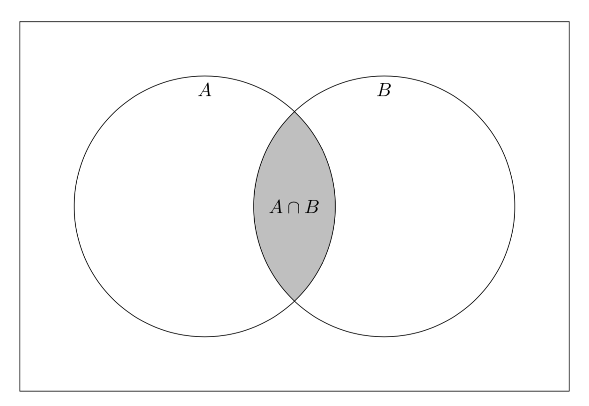

# Föreläsning 2

## Sannolikhetsbegreppet


### Slumpförsök och utfallsrum

Ett slumpförsök är ett försök där man inte säkert kan förutsäga dess utfall oavsett hur många gånger man gjort försöket tidigare och känner till förutsättningarna. Mängden av de möjliga utfallen är försökets utfallsrum


* Singla slant, utfallsrum $$S =\{\text{krona, klave}\}$$ 
* Kasta tärning, utfallsrum $$S =\{1,2,3,4,5,6 \}$$ 
* Köpa lott, utfallsrum $$S =\{\text{vinst, ej vinst}\}$$ 
* Om elementen utfallsfummen är uppräkneliga så är utfallsrummet **diskret**
* Om utfallsrummet är ett intervall på tallinjen så är utfallsrummet **kontinuerligt**


## Händelse

* En händelse är en delmängd av försökets utfallsrum
* En **säker** händelse består av alla händelser \(hela utfallsrummet\)
* En **omöjlig** händelse är inget utfall


I Föreläsning 1 gick vi igenom mängdbeteckningarna $$\cap, \cup, \overline{A}, \emptyset$$ . Dessa symboler har analoga betydelser  för händelser.



Om $$A,B$$ är händelser så är

| Uttryck | Händelse |
| :--- | :--- |
| $$A \cup B$$  | minst en av händelserna |
| $$A\cap B$$  | båda händelserna |
| $$A \cap \overline{B}$$  | enbart händelsen $$A$$  |
| $$\overline{A} \cap B$$  | enbart händelsen $$B$$  |
| $$\overline{A} \cap \overline{B}$$  | ingen av händelserna |
| $$(A \cap \overline{B}) \cup (\overline{A} \cap B)$$  | exakt en av händelserna |


Om $$A$$ och $$B$$ inte kan inträffa samtidigt är händelserna **disjunkta.** 

Detta betecknas $$A \cap B = \emptyset$$ 


### Sannolikheter för en händelse

#### Exempel

En tentamen i matematik innehåller 5 uppgifter som gav 1 poäng per uppgift. Totalt så var det 100 studenter som skrev tentan. Sammanställning av resultatet från tentamen kan beskrivas med följande tabell

| Poäng | 0 | 1 | 2 | 3 | 4 | 5 |
| :--- | :--- | :--- | :--- | :--- | :--- | :--- |
| Antal studenter | 10 | 20 | 30 | 20 | 10 | 10 |
| Relativ frekvens | 0.1 | 0.2 | 0.3 | 0.2 | 0.1 | 0.1 |

Vad är sannolikheten att en slumpvis vald student som skrev tentan hade minst 3 poäng?

De gynnsamma utfallen \(3, 4, 5 poäng\) har olika sannolikhet. Den klassiska sannolikhetsdefinitionen kan därför inte tillämpas.

Mer rimligt är att betrakta summan av de relativa frekvenserna, dvs

$$
\Pr(\text{minst 3 poäng}) = 0.2+0.1+0.1 = 0.4
$$


## Elementarsannolikheter

I ett slumpförsök med utfallsrummet $$S = \{e_1,e_2, \ldots e_N \}$$ har varje utfall $$e_i$$ en sannolikhet $$\Pr(e_i)$$. Talen $$\Pr(e_i)$$ kallas elementarsannolikheter och uppfyller

1. $$\Pr(e_1) \geq 0$$ 
2. $$\displaystyle\sum_{e_i \in S} \Pr(e_i) = \Pr(e_1) + \Pr(e_1) + \ldots + \Pr(e_N) = 1$$ 



## Sannolikheten för en händelse

Sannolikheten för att händelsen $$A$$ är summan av elementarsannolikheterna för de utfall som gör att $$A$$ inträffar, dvs

 $$\Pr(A) = \displaystyle\sum_{e_i \in A} \Pr(e_i)$$ 


### Två händelser

I ett slumpförsök med flera händelser så kan detta leda många frågeställningar.

Betrakta slumpförsöket med kast med två tärningar så vi t.ex att $$A$$ är händelsen **"summan av tärningarna är minst 10"** och $$B$$ är händelsen **"ingen av tärningarna är en sexa"**.

* Vad är sannolikheten att båda $$A$$ och $$B$$ inträffar?
* Vad är sannolikheten att bara $$A$$ inträffar?
* Vad är sannolikheten exakt en händelserna $$A$$ och $$B$$ inträffar?


## Sannolikhetslärans additionssats

Om $$A$$ och $$B$$ är två händelser som kan inträffa vid är slumpförsök så är sannolikheten att minst en av händelserna inträffar 

$$\Pr(A \cup B) = \Pr{(A)} + \Pr{(B)} - \Pr(A\cap B)$$ 

I termen $$\Pr{(A)} + \Pr{(B)}$$ så har sannolikheten för utfallet $$A\cap B$$ räknats två gånger, därför måste vi subtrahera $$\Pr(A\cap B)$$ .


### Exempel

Antag att vi kastar en blå tärning och en grön tärning och vi studerar sannoliketen för händelsen $$A\cup B$$ , där $$A$$ händelsen är "**blå tärning är en femma**" och $$B$$ är händelsen "**grön tärning är en sexa**"

Vi har att

$$
\Pr(A\cup B) = \Pr{(A)} + \Pr{(B)} - \Pr(A\cap B) = \frac{1}{6} + \frac{1}{6} - \frac{1}{36} = \frac{11}{36}.
$$

Sannolikheten för att $$A$$ eller $$B$$ inträffar är alltså ca $$31\%$$

### Exempel \(fortsättning\)

Med komplementregeln så kan vi beräkna $$\Pr(A\cup B)$$ enligt

$$
\Pr(A\cup B) = 1 - \Pr(\bar{A} \cap \bar{B})
$$

eller i klartext $$\Pr(\text{minst en händelse}) = 1 - \Pr(\text{ingen händelse})$$

### Betingade sannolikheter

Antag att vi ska beräkna sannolikheten för en händelse $$A$$. Hur påverkas det att man vet att en händelse $$B$$ har inträffat?

### Exempel

Man kastar två tärningar

* Vad är sannolikheten att den ena tärningen visar en sexa om man vet att summan av båda tärningarna är 11?
* Vad är sannolikheten att den ena tärningen är en femma om vet att båda tärningarna visa udda antal prickar?


## Betingad sannolikhet

Den betingade sannolikheten för händelsen $$A$$ under förutsättning att händelsen $$B$$ har inträffat är 

$$\Pr(A | B) = \dfrac{\Pr(A \cap B)}{\Pr(B)}$$ , där $$\Pr(B) > 0$$ 


Eftersom vi vet att händelsen $$B$$ har inträffat så begränsas ufallsrummet till mängden $$B$$ , men för att $$A$$ska inträffa så måste den även tillhöra mängden $$A$$ . 


## Sannolikhetslärans multiplikationssats

Låt $$A$$ och $$B$$ är händelseler som kan inträffa vid ett slumpförsök. Sannolikheten att både $$A$$ och $$B$$ inträffar är

$$\Pr(A\cap B) = \Pr(A)\cdot \Pr(B | A)$$ 


### Exempel

Antag att vi slumpmässigt drar två stycken ur en kortlek. Vad är sannolikheten att de två korten är hjärter?

Låt $$A$$ och $$B$$ vara händelserna "valt kort är hjärter". Vi har då att

$$
\text{Pr}(A \cap B) = \text{Pr(A)}\cdot \text{Pr(B|A)} = \frac{13}{52} \cdot \frac{12}{51} = \frac{1}{17}
$$

Alternativt så kan vi tänka att antalet gynnsamma utfall är $${{13}\choose {2}}$$ och antalet sätt vi kan dra $$2$$ kort ur en kortlek är $${{52}\choose {2}}$$ vilket ger

$$
\dfrac{{{13}\choose {2}}}{{{52}\choose {2}}} = \frac{1}{17}
$$


## Oberoende händelse

Om  $$\Pr(A | B) = \Pr(A)$$ så är händelsen $$A$$ oberoende av händelsen $$B$$ 



## Multiplikationssatsen för oberoende händelse

Låt $$A$$ och $$B$$ vara två oberoende händelseler som kan inträffa vid ett slumpförsök. Sannolikheten att både $$A$$ och $$B$$ inträffar är

$$\Pr(A\cap B) = \Pr(A)\cdot \Pr(B)$$


* **Tärningskast**: Man kastar en tärning ett antal gånger.
  * Sannolikheten att man får en sexa är **oberoende** av vad man tidigare kastat
  * Sannolikheten att får en ett högre kast än föregående är **beroende** av vad man tidigare kastat.

## Satsen om total sannolikhet

Låt $$A$$ vara hela utfallsrummet och låt vara $$A_1,A_2, \ldots A_n$$ vara disjunkta händelser sådana 

$$
A = A_1 \cup A_2 \cup \ldots \cup A_n
$$

dvs. unionen utgör hela utfallsrummet. Då är sannolikheten för varje händelse $$B$$ 

$$
\text{Pr}(B) = \sum_{i=1}^n \text{Pr}(A_i)\cdot \text{Pr}(B|A_i)
$$

### Exempel

I ett elektroniskt system så kan två typer av fel inträffa. Låt $$A$$beteckna händelsen att det elektroniska systemet slutar fungera helt. Om det första felet $$F_1$$inträffar så är sannolikheten att $$A$$inträffar $$0.2$$och om det andra felet $$F_2$$ inträffar så är sannolikheten att systemet slutar fungera $$0.1$$. Mätningar under en tidsperiod visar att det är sannolikhet $$0.4$$att $$F_1$$inträffar och sannolikhet $$0.3$$att $$F_2$$inträffar. Sannolikheten att det elektroniska systemet inträffar under denna tidsperiod är alltså

$$
\text{Pr}(A) = \text{Pr}(F_1)\cdot \text{Pr}(A | F_1) +\text{Pr}(F_2)\cdot \text{Pr}(A | F_2) = 0.4\cdot 0.2 + 0.3\cdot 0.1 = 0.11
$$

## Bayes' sats

Om vi formulerar omfrågeställningen. Givet en mängd disjunkta händelser sådana att $$A = A_1 \cup A_2 \cup \ldots \cup A_n$$, vad är sannolikheten att $$A_k$$inträffar då vi vet att $$B$$inträffat?

Från definitionen av betingad sannolikhet så får vi

$$
\Pr(A_k | B ) = \frac{\Pr(A_k \cap B)}{\Pr(B)} = \frac{\Pr(A_k)\cdot \Pr(B | A_k)}{\displaystyle\sum_{i=1}^n \text{Pr}(A_i)\cdot \text{Pr}(B|A_i)}
$$


## Bayes' sats

 låt vara $$A_1,A_2, \ldots A_n$$ vara parvis disjunkta händelser sådana $$A = A_1 \cup A_2 \cup \ldots \cup A_n$$. Då gäller det att

$$\Pr(Ak | B ) = \dfrac{\Pr(A_k)\cdot \Pr(B | A_k)}{\displaystyle\sum{i=1}^n \text{Pr}(A_i)\cdot \text{Pr}(B|A_i)}$$


### Bil eller get?

I ett tv-program förekom följande spel. En person från publiken får välja en av tre luckor. Bakom två av luckorna döljer sig en get och bakom en av luckorna så finns det en bil. Personen vinner ifall den väljer luckan med bilen. Spelaren väljer först en lucka som ej öppnas. Programledaren som vet vilken lucka som bilen befinner sig bakom och öppnar alltid en lucka som har en get. Personen från publiken får därefter valet ifall den vill byta lucka eller inte. En tankefälla är att det $$50\%$$att den finns bakom lucka $$1$$och $$50\%$$chans att den finns bakom lucka $$3$$. Det visar sig att det är rimligt att byta lucka. Antag att spelaren först väljer lucka 1, men att bilen finns bakom lucka 3. Låt $$A$$vara händelsen att programledaren öppnar lucka 2. Vi vill beräkna sannolikheten $$\Pr(L_3|A)$$ att bilen finns bakom lucka 3, givet att lucka 2 har öppnats. Låt $$L_i$$vara händelsen att bilen finns bakom lucka $$i $$.

$$
\Pr(L_3|A) =  \frac{\Pr(L_3\cap A)}{P(A)} = \frac{\Pr(A|L_3)\cdot \Pr(L_3)}{P(A|L_1)\cdot \Pr(L_1) +P(A|L_2)\cdot \Pr(L_2) + P(A|L_3)\cdot \Pr(L_3)}
$$

Som ger att

$$
\Pr(L_3|A) = \dfrac{1\cdot\cfrac{1}{3}}{\frac{1}{2}\cdot\frac{1}{3}+0\cdot \frac{1}{3}+1\cdot \frac{1}{3}}=\frac{2}{3}
$$

Man har alltså ca $$66\%$$ chans att vinna bilen ifall man byter lucka. De olika utfallen illustreras på följande länk [https://sv.wikipedia.org/wiki/Monty\_Hall-problemet\#F%C3%B6rst%C3%A5else\_av\_l%C3%B6sningen](https://sv.wikipedia.org/wiki/Monty_Hall-problemet#F%C3%B6rst%C3%A5else_av_l%C3%B6sningen)

Utan information så är sannolikheten lika stor att at bilen finns bakom luckorna lika stor, dvs $$\Pr(L_1) = \Pr(L_2) = \Pr(L_3)=\frac{1}{3}$$.

Om spelaren väljer lucka 1, så vet programledaren att bilen finns i lucka 3 och kommer därför garanterat öppna lucka 2 dvs $$\Pr(A|L_3) = 1$$.

