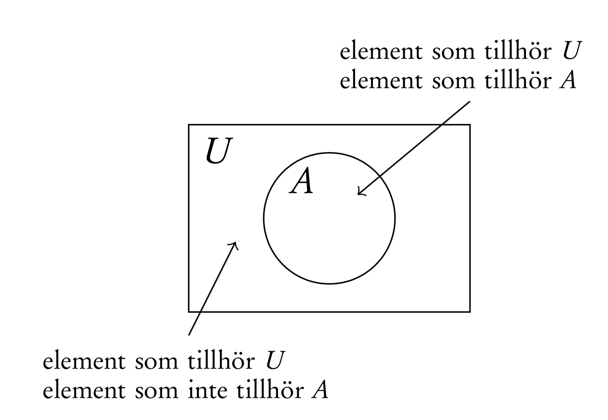
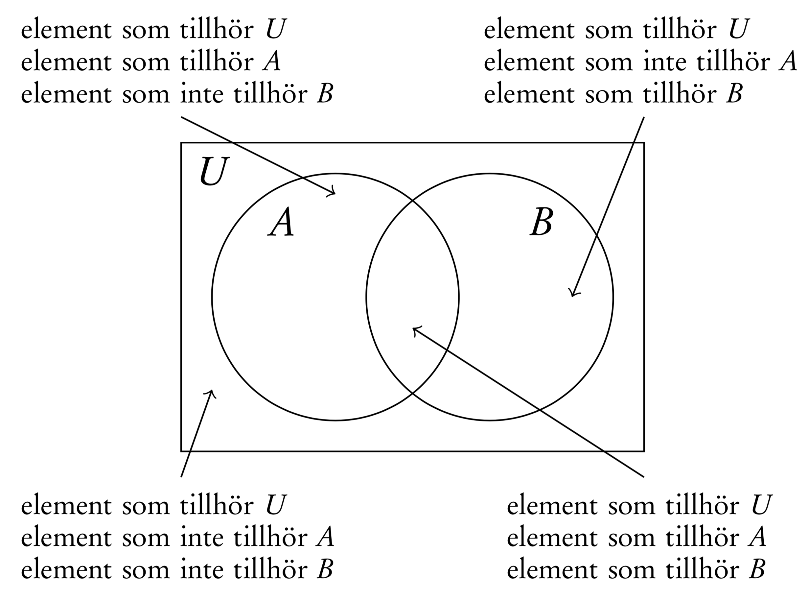

# Föreläsning 1

## Mängdlära

* En mängd är en samling unika objekt
* Jämfört med en datatypen array \(list\) så spelar ordningen på objekten ingen roll

Objekten som finns i en mängd kallas för **element**

Mängden av alla de objekt som i sammanhanget är relevanta kallas för **grundmängd \(universalmängd\)**

## Vad är en sannolikhet?

Sannolikheter är ett sätt att uttrycka osäkerhet i olika situationer

### Inledande exempel

* Vad är sannolikheten att jag vinner på lotto?
* Hur stor chans är det att det regnar imorgon?
* Hur stor är risken att man blir träffad av blixten?

### Den klassiska sannolikhetsdefinitionen

Om $$A$$ är en händelse, så är sannolikheten att $$A$$ inträffar


 $$\Pr(A) = \dfrac{\text{antalet gynnsamma utfall för $A$}}{\text{antalet möjliga utfall}}$$ 


Förutsättning är att det finns ett ändligt antal ändligt antal möjliga utfall.

### Exempel

Vid ett tärningskast så är utfallsrummet $$1,2,3,4,5,6$$ 

Om $$A$$ är händelsen att en tärning visar **minst** en femma, så är sannolikheten att A inträffar

$$
\Pr(A) = \frac{2}{6} = \frac{1}{3}
$$

eftersom en femma eller sexa är gynnsamma utfall.

### Komplementhändelse

Om A är en händelse, så är **komplementet** _till_ $$A$$ __\(betecknat som $$\overline{A}$$ \), händelsen att $$A$$ inte inträffar

### Komplementregeln

Om sannolikheten att händelsen $$A $$ inträffar är $$\Pr(A)$$, så sannolikheten att $$A$$ inte inträffar


$$\Pr(\overline{A}) = 1 - \Pr(A)$$ 


### Tärningsexemplet igen

Sannolikheten är att man vid kast med en tärning får **högst** en fyra 

$$
\Pr(\text{högst en fyra})= 1 - \Pr(\text{minst en femma}) = 1 - \frac{1}{3} = \frac{4}{6} = \frac{2}{3}
$$

### Upprepningsbara försök och relativ frekvens

Den **relativa frekvensen** är antalet gynnsamma utfall dividerat med antal försök.


### Upprepningsbara försök

Vid upprepningsbara försök är sannolikheten för en händelse det tal den relativa frekvensen närmar sig när antalet försök växer


### Exempel

Antag att vi har en mängd $$S$$ som vi består av några heltal

$$
S = \{1,89,-12,7 \}
$$

* Talet 89 tillhör mängden $$S$$. Detta betecknas $$89 \in S$$ 
* Talet 16 tillhör inte mängden $$S$$. Detta betecknas $$16 \notin S$$ 



```javascript
const S = new Set([1,89,-12,7]);

S.has(1);  // => true
S.has(89); // => true
S.has(10); // => false
```




Den mängd som inte innehåller något element kallas för den **tomma mängden** och betecknas med $$\emptyset$$ eller $$\{\}$$ 


### Delmängder

Antag att vi har två mängder

$$
A = \{1,2,3 \}, \quad B = \{3,2,14,5,1 \}
$$

I exemplet ovan så finns alla element i mängden$$A$$ finns även med i mängden $$B$$. Man säger då att $$A$$ är en delmängd till $$B$$ 


Om $$A$$är en delmängd $$B$$, betecknas detta $$A \subseteq B$$. 


I det fall då $$A$$ är en delmängd till $$B$$ kan $$B$$ innehålla element som $$A$$ saknar. Man säger att $$A$$ är en äkta delmängd till $$B$$ om B $$B$$ innehåller minst ett element utöver de som $$A$$ innehåller och om så är fallet betecknas det $$A \subset B$$ .


Notera att det räcker med att endast ett element i $$A$$ inte tillhör $$B$$ för att $$A$$ inte ska vara en delmängd till $$B$$ 


### Mängdoperationer


Om $$A$$ och $$B$$ är mängder så är **snittet** $$A \cap B$$  mängden av alla element som finns i både $$A$$ och $$B$$ 


### Exempel

$$
\{a,b,c,x \} \cap \{a, x,y,z \} = \{a,x\}
$$


Om $$A$$ och $$B$$ är mängder så är **unionen** $$A \cup B$$  mängden av alla element som finns i$$A$$ eller $$B$$ 


### Exempel

$$
\{a,b,c,x \} \cup \{a, x,y,z \} = \{a,b,c,x,y,z\}
$$


**Komplementmängden** till en mängd$$A$$är mängden av de element som inte tillhör $$A$$ . Denna mängd betecknas med $$\overline{A}$$ .


### Exempel

Givet universalmängden $$U = \{1,2,\ldots, 9,10\}$$ och mängden $$A = \{2,4,6,8 \}$$, så är komplementmängden

$$
\overline{A} = \{1,3,5,7,9,10\}
$$


### Venndiagram

Med Venndiagram så kan man illustrera hur hur mängder förhåller sig till varandra

### Venndiagram med en mängd



#### Venndiagram med två mängder



## Kombinatorik - på hur många sätt?

I kombinatoriken studerar man kombinationer, permutationer och uppräkningar av element av mängder

* På hur många sätt kan man dra 3 kort ur en kortlek?
* På hur många sätt kan man ställa 10 personer i en kö?

### Exempel

På hur många sätt kan man skapa en pin-kod 4 siffror om man bara använda samma siffra en gång?

1. Första siffran kan vi välja fritt bland $$1,2,3,\ldots 9,0$$ 
2. För den andra siffran så har vi $$9$$ alternativ kvar
3. För siffra tre så har vi $$8$$ alternativ att välja på
4. För den sista siffran har vi $$7$$ alternativ

Totalt finns det $$10\cdot 9 \cdot 8 \cdot 7 = 5040$$ olika sätt man kan välja pin-kod där ingen siffra har återanvänts


### Multiplikationsprincipen

Om man ska utföra $$k$$ stycken operationer och antalet möjliga operationer är $$n_1, n_2, \ldots n_k$$. Då är det totala antalet sätt man kan utföra operationerna $$n_1 \cdot n_2 \cdot \ldots \cdot n_k = n!$$ .

Talet $$n!$$ utläses " $$n$$ -fakultet"



$$0! = 1$$ 




```javascript
// https://stackoverflow.com/questions/3959211/what-is-the-fastest-factorial-function-in-javascript

function factorial(num)
{
    var fac=1;
    for (var i = 2; i <= num; i++)
        fac = fac * i;
    return fac;
}
```




$$n!$$ växer snabbt


### Exempel

Andreas, Emil, Kenneth och Mos spelar en pingisturnering. På hur många sätt kan sluttabellen efter turneringen se ut?

> Samtliga möjliga fall är
>
> 1. 'aar', 'efo', 'lew', 'mos'
> 2. 'aar', 'efo', 'mos', 'lew'
> 3. 'aar', 'lew', 'efo', 'mos'
> 4. 'aar', 'lew', 'mos', 'efo'
> 5. 'aar', 'mos', 'efo', 'lew'
> 6. 'aar', 'mos', 'lew', 'efo'
> 7. 'efo', 'aar', 'lew', 'mos'
> 8. 'efo', 'aar', 'mos', 'lew'
> 9. 'efo', 'lew', 'aar', 'mos'
> 10. 'efo', 'lew', 'mos', 'aar'
> 11. 'efo', 'mos', 'aar', 'lew'
> 12. 'efo', 'mos', 'lew', 'aar'
> 13. 'lew', 'aar', 'efo', 'mos'
> 14. 'lew', 'aar', 'mos', 'efo'
> 15. 'lew', 'efo', 'aar', 'mos'
> 16. 'lew', 'efo', 'mos', 'aar'
> 17. 'lew', 'mos', 'aar', 'efo'
> 18. 'lew', 'mos', 'efo', 'aar'
> 19. 'mos', 'aar', 'efo', 'lew'
> 20. 'mos', 'aar', 'lew', 'efo'
> 21. 'mos', 'efo', 'aar', 'lew'
> 22. 'mos', 'efo', 'lew', 'aar'
> 23. 'mos', 'lew', 'aar', 'efo'
> 24. 'mos', 'lew', 'efo', 'aar'

Detta följer från multiplikationsprincipen. Det finns $$4$$ val för att sätta en vinna i turneringen. Därefter återstår det $$3$$ alternativ för andraplatsen, $$2$$ alternativ för tredjeplatsen och slutligen $$1$$ alternativ för som hamnar på fjärde plats, dvs

$$
4 \cdot 3\cdot 2 \cdot 1 = 24
$$

Allmänt kallar man en sådan ordningsföljd för en **permutation.**


### **Permutationer**

$$n$$ stycken olika element kan permuteras på $$\\n! =n\cdot (n-1)\cdot (n-2) \cdot \ldots \cdot 3 \cdot 2 \cdot 2\cdot 1 \\$$olika sätt.


### Ordnade delmängder \(Urval med hänsyn till ordning\)

På hur många sätt kan välja ut 3 st favoritpizzor och rangordna dessa från en meny som består av 10 olika pizzor.

> Från multiplikationsprincipen så har att antalet sätt vi kan välja ut våra 3 favoritpizzor
>
> $$10\cdot 9 \cdot 8 = 720$$ 
>
> Detta kan även skriva som
>
>  $$10\cdot 9 \cdot 8 =  \dfrac{10\cdot 9 \cdot 8 \cdot  7 \cdot 6 \cdot 5 \cdot 4\cdot 3 \cdot 2\cdot 1}{ 7 \cdot 6 \cdot 5 \cdot 4\cdot 3 \cdot 2\cdot 1} = \dfrac{10!}{7!} = \dfrac{10!}{(10-3)!}$$


Antalet sätt vi kan välja $$k$$ objekt av $$n$$ möjliga val **med hänsyn till ordning** är

$$\dfrac{n!}{(n-k)!}$$ 


### Kombinationer \(Urval utan hänsyn till ordning\)


Antalet sätt vi kan välja $$n$$ objekt av $$N$$ möjliga val **utan hänsyn till ordning** är

$$\displaystyle{n\choose k} = \dfrac{n!}{k! \cdot (n-k)!}$$ 


$$\displaystyle{n\choose k} $$ utläses **"n över k"**

