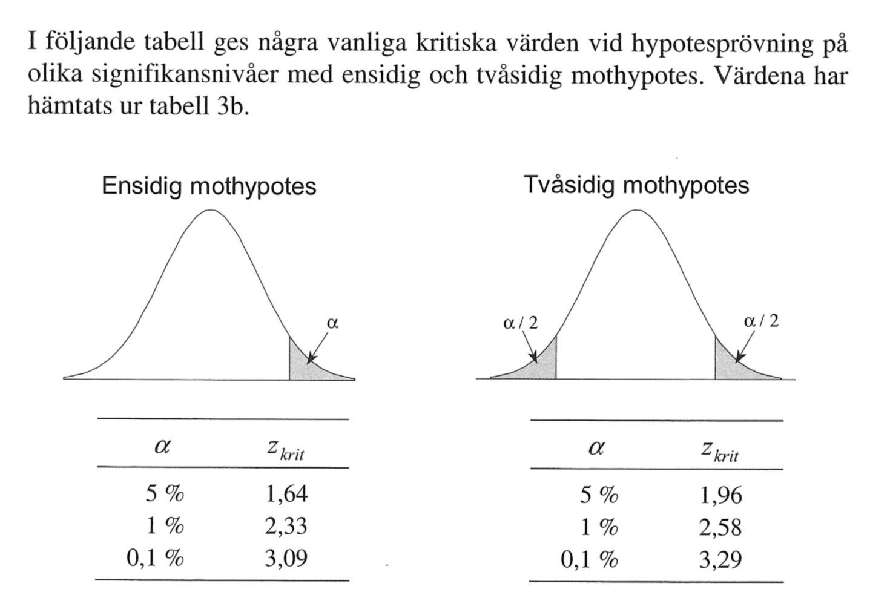

# Föreläsning 7


Kursuteckling pågår


## Statistisk felmarginal

I föregående föreläsning så lärde vi oss beräkna konfidensintervall för en populations andel $$\pi$$med

$$
p \pm z \cdot \sqrt { \frac { p ( 1 - p ) } { n } }
$$

Talet

$$
z\cdot\sqrt { \frac { p ( 1 - p ) } { n } }
$$

kallas för den **statistiska felmarginalen**

### Exempel. Hur många röstar på Vänsterpartiet?

I ett riksdagsval fick vänsterpartiet $$9\%$$ av rösterna. I en ny stickprovsundersökning med $$1000$$ personer några månader senare så sympatiserar $$10\%$$ med vänsterpartiet. Vilka slutsatser kan vi dra? Har vänsterpartiet blivit mer populärt bland väljarna?

Vi har att $$p = \dfrac{100}{1000} =0.1$$ . Väljer vi konfidensgraden $$95\%$$ så har vi att den statistiska felmarginalen blir

$$
1.96\sqrt{\dfrac{0.01(1-0.01)}{1000}} = 0.01859
$$

vilket motsvara $$1.8$$ procentenheter. Detta är ett mått på hur mycket slumpen påverkar ett stickprov av storlek $$n = 1000$$ .

Skillnaden mellan valresultatet och det uppskattade resultatet är $$1$$ procentenheter, vilket är mindre felmarginalen.

* Skillnaden på resultaten **kan bero** på slumpen.
* Vänsterpartiets ökade stöd kan inte s**tatistisk säkerställas** 
* Skillnaden måste inte har berott på slumpen, men vi kan utifrån stickprovsundersökningen **inte** dra några slutsatser.

## Statistisk signifikans

Används för att säkerställa att mätvärden, förändringar etc inte beror på slumpen

## Exempel

Ett läkemedelsföretag har tagit fram en medicin som sänker blodtrycket hos personer. 

* Man väljer slumpmässigt personer med högt blodtryck
* Man mäter blodtrycket före och efter medicinering.
* Efter medicineringen har blodtrycket i medeltal sjunkit.

Beror detta på att medicinen fungerade eller beror det på slumpen?

## Tillvägagångssätt

### 1. Formulera noll- och mothypotes

* Nollhypotes $$H_o$$ - ingen förändring sker.  Eventuella observerade skillnader har uppkommit av en slump.
* Mothypotes $$H_1$$ - Skillnad existerar och att den inte beror på slumpen.

### 2. Bestäm signifikansnivån $$\alpha$$ 

* Sannolikheten \(risken\) att $$H_0$$ förkastas trots att den är sann. Vanligtvis $$\alpha = 5\%$$ dvs det är $$5\%$$ sannolikhet att nollhypotsen förkastas trots att den är sann.

### 3. Definiera och beräkna teststorhet

$$
Z = \dfrac{\text{observerat värde - hypotetiskt värde}}{\text{medelfel för det observerade värdet}}
$$

Om undersökningsvariabeln är normalfördelad med känd standardavvikelse $$\sigma$$ så använder vi

$$
Z = \dfrac{\overline{X} - \mu}{\sigma/\sqrt{n}}
$$

Om standardavvikelsen inte är känd använder vi standardavvikelsen för ett stort stickprov.

$$
Z = \dfrac{\overline{X} - \mu}{s/\sqrt{n}}
$$

### 4. Beräkna p-värde

Beräkna utifrån teststorheten sannolikheten att observera ett utfall minst så extremt som det som observerats, förutsatt att $$H_0$$ är sann. 

$$
p = \Pr( H_1 \text {sann } | H_0 \text{ sann})
$$

$$p$$ -värdet är sannolikheten att få det resultat du fått om nollhypotesen $$H_0$$ är sann

* $$p < 0.001$$ starkt stöd för mothypotesen \(trestjärnig signifikans\)
* $$p<0.01$$ även detta starkt stöd för mothypotesen \(tvåstjärnig signifikans\)
* $$0.01 < p < 0.05$$ \(enstjärnig signifikans\)
* $$p > 0.05$$ ingen signifikans. Nollhypotesen kan ej förkastas

### Exempel

### [https://www.youtube.com/watch?v=KS6KEWaoOOE](https://www.youtube.com/watch?v=KS6KEWaoOOE)

Antag att besökare surfar på webbsidan $$25$$ minuter i snitt, dvs $$\mu = 25$$ 

* $$H_0: \mu = 25$$ 
* $$H_1: \mu > 25$$ 

Vi ändrar bakgrundsfärgen till gult och mäter slumpvis $$100$$ besökare

* $$n= 100$$, 
* $$\overline{x} = 25.2$$ 
* $$\sigma = 1.4$$ 

Vi har att

$$
p = \Pr\left( Z > \frac{25.2 - 25}{1.4/\sqrt{100}} 
= 1.428572\right) = 0.076 > 0.05
$$

Så det skulle inte löna sig att byta färg på hemsidan. Om däremot $$\sigma = 1$$ 

$$
p = \Pr\left( Z > \frac{25.2 - 25}{1/\sqrt{100}} 
= 2\right) = 0.023^* < 0.05
$$

så skulle det löna sig att byta färg på hemsidan till gul.

## Olika typer av hypoteser

### Endsidig mothypotes

$$
\begin{cases}
H_0: \mu = \mu_0 \\
H_1: \mu > \mu_0
\end{cases} \quad \text{eller}\quad \begin{cases}
H_0: \mu = \mu_0 \\
H_1: \mu < \mu_0
\end{cases}
$$

### Tvåsidig mothypotes

$$
\begin{cases}
H_0: \mu = \mu_0 \\
H_1: \mu \neq \mu_0
\end{cases}
$$

## 

