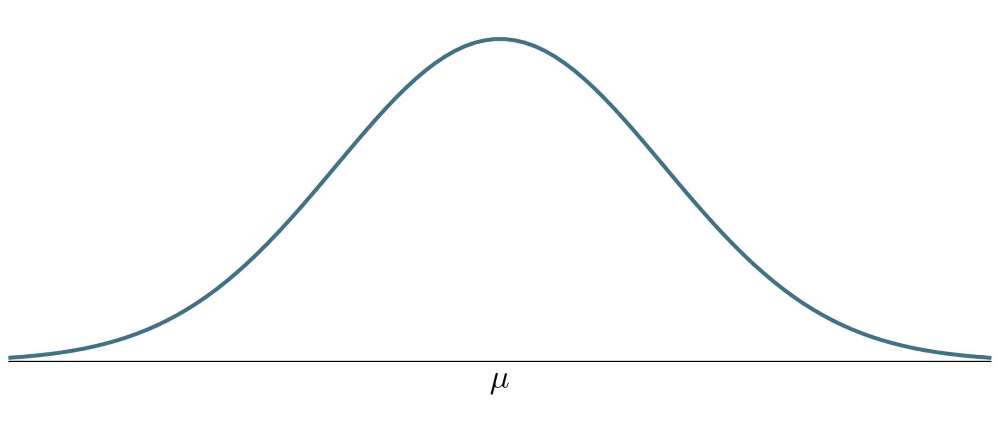
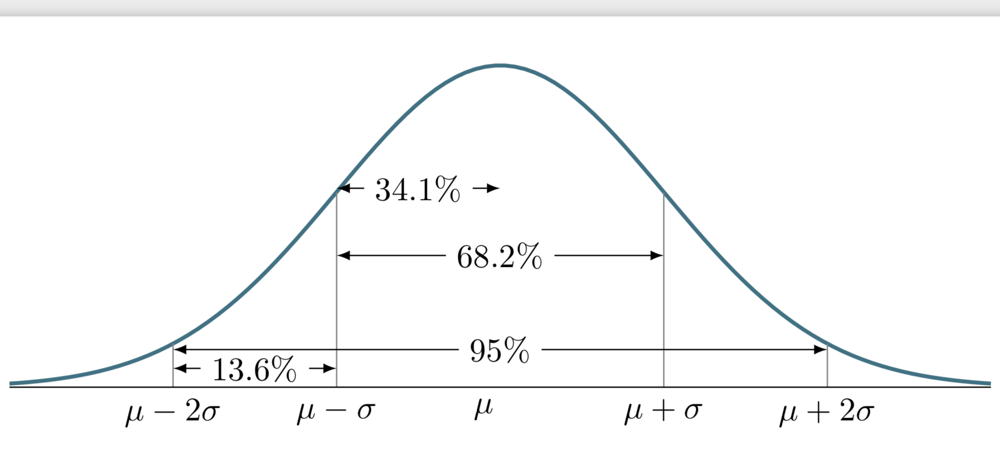
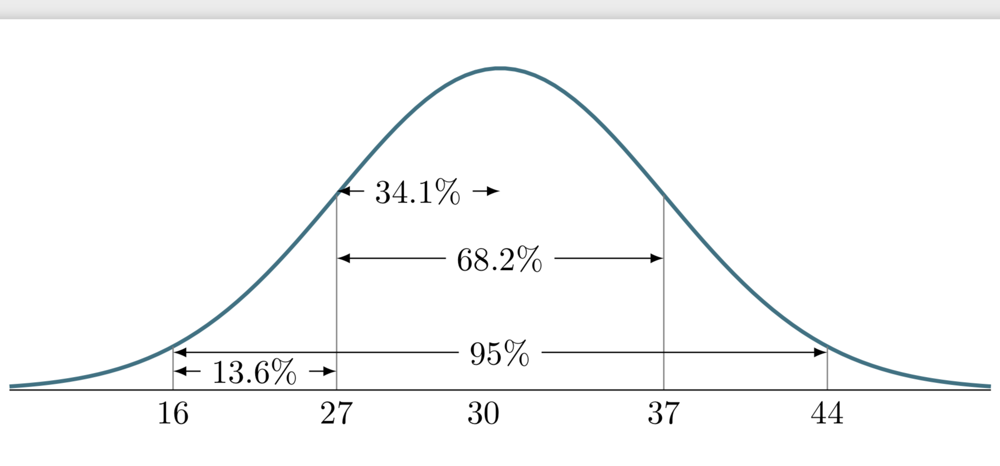
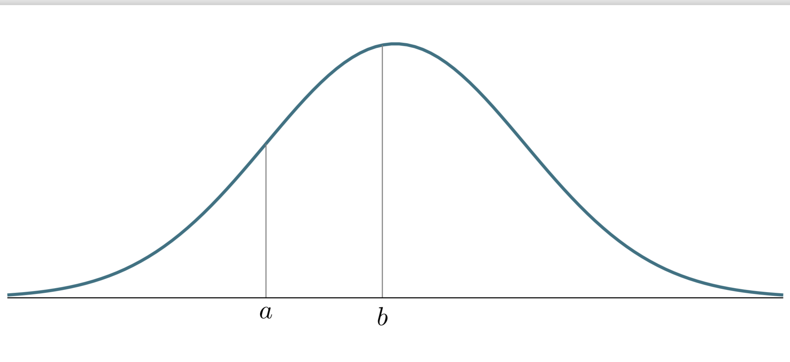

# Föreläsning 5

Vad är sannolikheten att slumpvis vald kvinna i Sverige är 165 cm lång?

Sannolikheten att en slumpvis vald kvinna är 165 cm lång är avsevärt större än att hon är 140 cm eller 190 cm lång.

Vid observationer eller mätningar så visar det sig att de flesta mätvärdena tenderar att ligga ligga nära mätningarnas medelvärde.

Om $$\mu$$ är väntevärdet så kan fördelningen illustreras med följande figur.

Höjden på grafen anger sannolikheten, dvs, det är högre sannolikhet ju närmare $$\mu$$ ett observations- eller mätvärde befinner sig desto högre sannolikhet att den inträffar.

Låt $$\sigma$$ vara standardavvikelsen och $$\mu$$ medelvärdet \(väntevärdet\). Hur en \(kontinuerlig\) slumpvariabel fördelar sig kan illustreras med följande figur.

### Exempel

Resultat från en tentamen i matematik var normalfördelat med medelvärdet 30 poäng och standardavvikelsen 7 poäng. Av de studenter som skrev tentamen, hade 65 studenter ett resultat i intervallet 16–37 poäng. Hur många studenter skrev tentamen?

Vi har att $$\mu = 30, \sigma = 7$$ .

Vi ser att $$13.6 + 68.2 = 81.8 \%$$ av studenterna som hade ett resultat i intervall 16-37 poäng. Total så var det alltså

$$
\frac{65}{0.818} \approx 79
$$

som skrev tentan.

### Fördelningsfunktion

En slumpvariabel $$X$$ som kan beskriva med uttrycket

$$
f ( x ) = \frac { 1 } { \sigma \sqrt { 2 \pi } } e ^ { \left( - \frac { ( x - \mu ) ^ { 2 } } { 2 \sigma ^ { 2 } } \right) }
$$

sägs vara normalfördelad med parametrarna $$\mu$$ och $$\sigma$$.

Sannolikheten att en variabel $$X$$ befinner sig i intervallet $$(a,b)$$ kan då bestämmas genom att beräkna integralen. **Obs! I boken används** $$Z$$ 

$$
\Pr(a < X < b) = \int_a^b f(x) \;dx
$$

Integralen motsvarar arean under kurvan från $$a$$ till $$b$$ 

Integralen är svår att beräkna. 

Ofta är medelvärdet $$0$$ och väntevärdet . Om $$X$$ är en normalfördelad variabel med väntevärde $$0$$ och standardavvikelse $$1$$ , så säges $$X$$ vara **standard normalfördelad.** Kortfattat så kan skriva detta

$$
X \text{ är } N(0,1)
$$

 Använd tabell [http://www.maths.lth.se/matstat/kurser/tabeller/tabeller.pdf](http://www.maths.lth.se/matstat/kurser/tabeller/tabeller.pdf) för standardiserad för normalfördelning. Allmänt betyder beteckningen  $$X$$ är $$N(\mu, \sigma)$$ att är en normalfördelad variable med väntevärde $$\mu$$ och standardavvikelse $$\sigma$$ .

### Exempel

Visa i tabell $$\Pr(X \leq 1.93)$$

VIsa i tabell$$\Pr(X \geq 0.45) = 1 - \Pr(X < 0.45)$$

